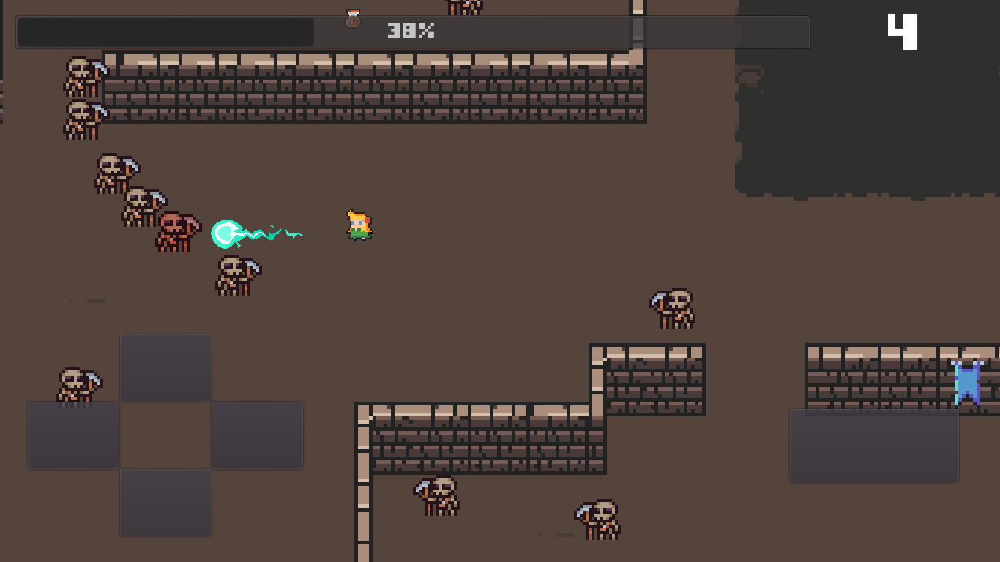
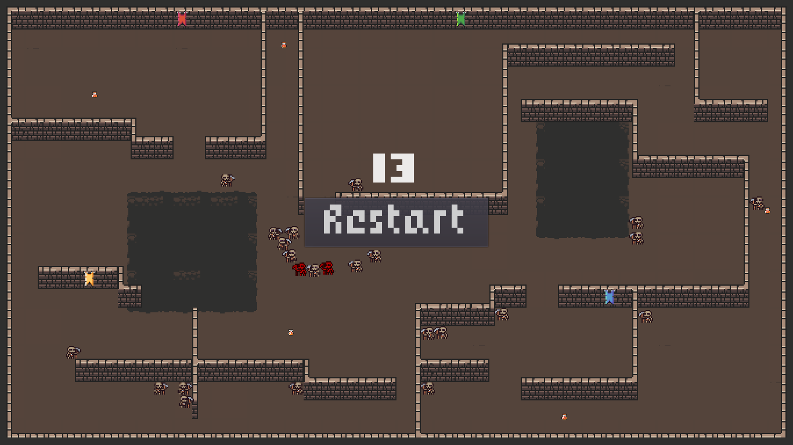
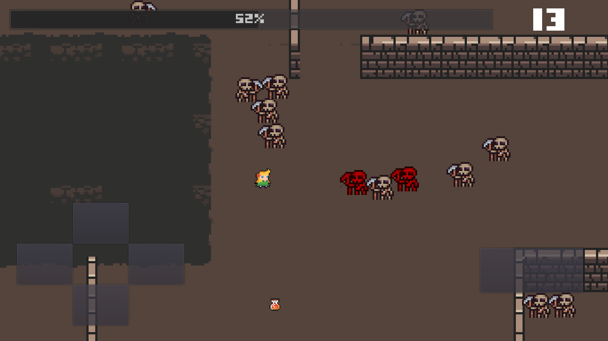

# DungeonRPG
 Try to survive in a dungeon full of skeletons.
 
 
 
 
 
 
 
 Google Play:
  - https://play.google.com/store/apps/details?id=com.godot.lubenem
 
 # Credits
 
 Game Engine: 
 - Godot 3.1.1, https://godotengine.org/
 
Sprites:
 - Elthen, https://elthen.itch.io/2d-pixel-art-dungeon-tileset
 - Pixel_Poem, https://pixel-poem.itch.io/dungeon-assetpuck
 - 0x72, https://0x72.itch.io/dungeontileset-ii
 - Game Developer Studio, https://opengameart.org/content/high-res-fire-ball
 - Uheartbeast, https://opengameart.org/content/mobile-rpg-resources
 
 Sound:
 - Gundatsch, https://soundcloud.com/gundatsch
 - LittleRobotSoundFactory, https://freesound.org/people/LittleRobotSoundFactory/sounds/270311/
 - "digital two tone beep 5", https://www.zapsplat.com
